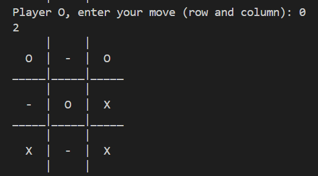
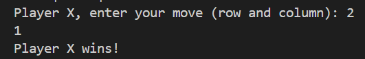
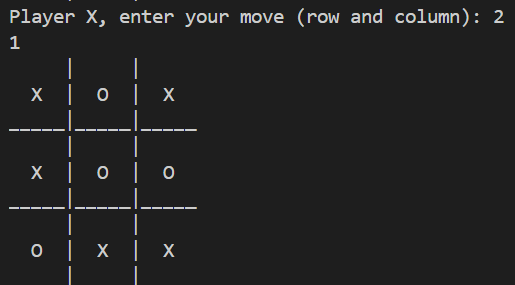
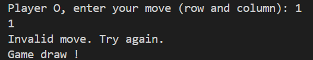

# Tic-Tac-Toe Game in C++: An Object-Oriented Showcase

## Overview
This project demonstrates my understanding of **object-oriented programming (OOP)** by implementing a classic **Tic-Tac-Toe** game in C++. The game features a 3x3 grid where two players take turns marking their symbols ('X' or 'O') on the board. The goal is to get three of their symbols in a row (horizontally, vertically, or diagonally) to win.

## Features
- **TicTacToe Class**: I've encapsulated the game logic within a `TicTacToe` class, emphasizing OOP principles.
- **Private Member Variables**:
    - `space`: Represents the game board, initialized with empty spaces ('-').
    - `playerXScore` and `playerOScore`: Keep track of player scores.
- **Constructor**:
    - `TicTacToe()`: Initializes the game board and sets scores to 0.
- **Methods**:
    - `displayspace()`: Displays the current state of the board.
    - `makeMove(int row, int col, char player)`: Allows a player to make a move.
    - `checkWin(char player)`: Determines if a player has won.
- **Main Function**:
    - Creates an instance of `TicTacToe`.
    - Runs a loop for a maximum of 9 turns.
    - Displays the board and prompts the current player for their move.
    - Validates the move, updates the board, and checks for a win.
    - Announces the winning player or declares a draw.

## Example Usage

    // Game loop
    while (!game.isGameOver()) {
        game.displayspace();
        char currentPlayer = game.getCurrentPlayer();
        std::cout << "Player " << currentPlayer << ", enter your move (row col): ";
        int row, col;
        std::cin >> row >> col;

        if (game.makeMove(row, col, currentPlayer)) {
            if (game.checkWin(currentPlayer)) {
                std::cout << "Player " << currentPlayer << " wins!" << std::endl;
                break;
            }
        } else {
            std::cout << "Invalid move. Try again." << std::endl;
        }
    }

    if (game.isDraw()) {
        std::cout << "It's a draw!" << std::endl;
    }

    return 0;

## Screenshots

  
  
  
Winning Scenario

  <button onclick="prevSlide()">Previous</button>
  <button onclick="nextSlide()">Next</button>
  
  
  
Draw Scenario

## How to Compile and Run

- Compile the code using a C++ compiler (e.g., g++).
- Execute the compiled binary.
- Enjoy playing Tic-Tac-Toe!
